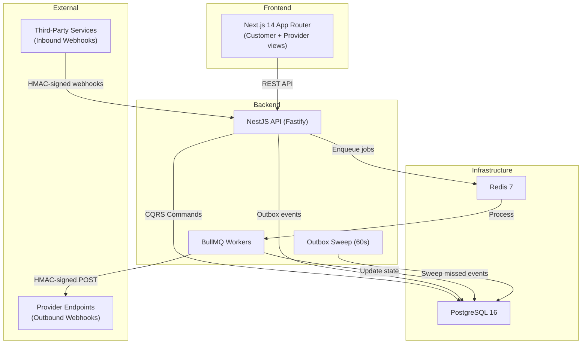

# BookIt

Service booking platform for Metro Manila providers. Each provider gets a shareable booking link with real-time availability — replacing Messenger DMs and manual scheduling.

Built with **NestJS (Fastify)**, **TypeORM**, **PostgreSQL**, **BullMQ**, and **Next.js 14**.

## Architecture



### Booking Flow

```
Customer selects slot → POST /bookings (idempotency key)
                              ↓
                    ┌─ Check idempotency (return existing if duplicate)
                    ├─ Validate service (active? exists?)
                    ├─ Find/create customer by email
                    ├─ Calculate end time from duration
                    ├─ Save booking (EXCLUSION constraint prevents overlaps)
                    ├─ Generate HMAC access token
                    ├─ Publish BookingConfirmedEvent
                    │       ↓
                    │   EventsHandler → Outbox table
                    │       ↓                    ↓
                    │   BullMQ (immediate)    Cron sweep (fallback)
                    │       ↓
                    │   ├─ Email confirmation
                    │   ├─ Calendar .ics
                    │   └─ Webhook delivery (HMAC-signed)
                    └─ Return booking + access token
```

## Key Technical Decisions

| Decision | Rationale |
|----------|-----------|
| **PostgreSQL EXCLUSION constraint** over app-level locking | Database guarantees zero double-bookings atomically. App-level check-then-insert has a TOCTOU race condition. Redis distributed lock adds external dependency without atomicity. |
| **Outbox pattern + BullMQ** over direct queue dispatch | Events are written to the outbox table after the booking save, then dispatched to BullMQ for immediate processing. If BullMQ/Redis is down, the cron sweep catches missed events every 60 seconds. Belt-and-suspenders reliability. |
| **HMAC-signed guest tokens** over forced registration | Customers manage bookings (cancel/reschedule) via email links without creating an account. Tokens are generated with `crypto.createHmac('sha256')` and verified with `timingSafeEqual`. |
| **Inbound webhook signature verification** as mandatory | Every inbound webhook must include `X-Webhook-Signature`. Missing header → 401. Prevents unsigned event injection. |
| **Outbound HMAC-signed webhooks** with delivery log | Providers receive booking events at registered URLs. Each delivery is signed, logged with status code, and retried with exponential backoff (5 attempts). |
| **CQRS with domain events** over service-to-service calls | Commands (CreateBooking, CancelBooking) publish events. Separate handlers route to outbox, webhooks, and notifications — decoupled and independently testable. |
| **Modular monolith** over microservices | 9 domain modules with clean boundaries. Splitting into services adds distributed complexity with zero benefit at this scale. |
| **Individual TypeORM migrations** over monolith SQL | 11 migrations, one per table, each with `up()` and `down()`. Tracks applied state in `migrations` table. Rollback anytime with `pnpm migration:revert`. |
| **Fastify adapter** over Express | NestJS supports both. Fastify provides better performance and plugin model. Swapped from Express via `@nestjs/platform-fastify`. |
| **Pino structured logging** over console.log | JSON logs with X-Request-Id correlation. Every request gets a unique ID propagated through all log context. Health endpoint excluded from auto-logging. |

## Why These Patterns?

Each decision maps to a specific failure mode:

- **EXCLUSION Constraint** — Two customers book the same slot simultaneously. Without a database-level constraint, both succeed (TOCTOU race). The `tstzrange && operator` with `btree_gist` makes overlapping bookings physically impossible at the storage layer. Tested with 5 concurrent requests — exactly 1 wins, 4 get 409.

- **Outbox + BullMQ** — The API creates a booking and needs to send a confirmation email. If the email service is down, the customer never gets notified. Writing events to the outbox table ensures they survive. BullMQ picks them up immediately for fast processing; the cron sweep catches anything BullMQ missed.

- **Idempotency Keys** — A network timeout after the customer clicks "Book" causes the browser to retry. Without idempotency, the retry creates a second booking. The `idempotency_key` column with a partial unique index means the second request returns the original booking — no duplicate.

- **HMAC Guest Tokens** — Requiring login to cancel a booking increases friction and support tickets. HMAC tokens embedded in email links let guests manage bookings securely. `timingSafeEqual` prevents timing attacks on token validation.

## Tech Stack

| Layer | Technology |
|-------|-----------|
| Backend | NestJS 10, Fastify 4, TypeScript, CQRS |
| ORM | TypeORM 0.3, PostgreSQL 16 |
| Queue | BullMQ 5, Redis 7 |
| Frontend | Next.js 14 (App Router), Tailwind CSS, Zustand |
| Validation | class-validator (backend), Zod (shared schemas) |
| Testing | Jest (86 unit), Vitest (23 frontend), Supertest (21 e2e) |
| Logging | Pino (structured JSON, X-Request-Id correlation) |
| Monorepo | Turborepo, pnpm workspaces |
| CI | GitHub Actions (PostgreSQL + Redis services) |

## Quick Start

```bash
# Prerequisites: Node.js 20+, pnpm, Docker

# 1. Clone and install
git clone https://github.com/jeromejhipolito/booking-system.git
cd booking-system
pnpm install

# 2. Start infrastructure
docker compose up -d

# 3. Build shared packages
for pkg in shared-types shared-schemas shared-constants shared-utils; do
  (cd packages/$pkg && npx tsc)
done

# 4. Run database migrations
cd apps/api && pnpm migration:run

# 5. Start API
cd apps/api && npx nest start

# 6. Start frontend (new terminal)
cd apps/web && npx next dev --port 3002
```

- **API**: http://localhost:3001/v1
- **Frontend**: http://localhost:3002
- **Swagger**: http://localhost:3001/api-docs
- **Health**: http://localhost:3001/v1/health

### Demo Mode (no backend needed)

```bash
echo "NEXT_PUBLIC_DEMO_MODE=true" > apps/web/.env.local
cd apps/web && npx next dev --port 3002
```

## Database Migrations

```bash
cd apps/api
pnpm migration:run      # apply pending migrations
pnpm migration:revert   # rollback last migration
pnpm migration:show     # list migration status
```

11 individual migrations, one per table:

| # | Migration | What It Creates |
|---|-----------|----------------|
| 1 | CreateUsersAndAuth | users + refresh_tokens |
| 2 | CreateProviders | provider profiles + settings |
| 3 | CreateCustomers | customer records |
| 4 | CreateServices | service catalog + types |
| 5 | CreateAvailabilityRules | RRULE-based scheduling |
| 6 | CreateBookings | bookings + EXCLUSION constraint |
| 7 | CreateOutboxEvents | reliable event delivery |
| 8 | CreateReviews | ratings + comments |
| 9 | CreateWebhookSubscriptions | provider webhook URLs |
| 10 | CreateWebhookDeliveries | outbound delivery log |
| 11 | CreateWebhookIngestedEvents | inbound event store |

## API Endpoints

### Public (no auth)
| Method | Path | Purpose |
|--------|------|---------|
| `GET` | `/v1/health` | Liveness + DB + Redis status |
| `POST` | `/v1/auth/register` | Register new user |
| `POST` | `/v1/auth/login` | Login, returns JWT |
| `GET` | `/v1/services` | Browse services |
| `GET` | `/v1/services/:id` | Service detail |
| `GET` | `/v1/availability/slots` | Available time slots for a provider |
| `POST` | `/v1/bookings` | Create booking (guest checkout) |
| `GET` | `/v1/bookings/:id` | View booking (with access token) |
| `PATCH` | `/v1/bookings/:id/cancel` | Cancel (token or auth) |
| `PATCH` | `/v1/bookings/:id/reschedule` | Reschedule (token or auth) |
| `GET` | `/v1/reviews` | Reviews for a service |
| `POST` | `/v1/webhooks/ingest/:source` | Receive external webhooks (HMAC verified) |

### Authenticated (Bearer JWT)
| Method | Path | Purpose |
|--------|------|---------|
| `GET` | `/v1/users/me` | Current user profile |
| `PATCH` | `/v1/users/me` | Update profile |
| `POST` | `/v1/providers` | Create provider profile |
| `GET` | `/v1/providers/:id` | Provider detail |
| `PATCH` | `/v1/providers/:id` | Update provider |
| `POST` | `/v1/services` | Create service |
| `PATCH` | `/v1/services/:id` | Update service |
| `DELETE` | `/v1/services/:id` | Delete service |
| `POST` | `/v1/availability/rules` | Set availability schedule |
| `GET` | `/v1/availability/rules/:providerId` | Get provider's rules |
| `PATCH` | `/v1/availability/rules/:id` | Update rule |
| `DELETE` | `/v1/availability/rules/:id` | Delete rule |
| `POST` | `/v1/availability/rules/:id/exceptions` | Add date exception |
| `GET` | `/v1/bookings` | List bookings (paginated) |
| `POST` | `/v1/webhooks/subscriptions` | Register webhook endpoint |
| `GET` | `/v1/webhooks/subscriptions` | List subscriptions |
| `DELETE` | `/v1/webhooks/subscriptions/:id` | Remove subscription |
| `GET` | `/v1/webhooks/deliveries` | View delivery history |
| `POST` | `/v1/reviews` | Leave a review |

## Reliability Test Suite

Tests target the patterns that break in production, not CRUD operations:

| Test | Pattern Verified |
|------|-----------------|
| Same idempotency key returns same booking | Duplicate prevention |
| Overlapping time slot returns 409 | EXCLUSION constraint |
| 5 concurrent requests — exactly 1 wins | Race condition safety |
| Cancelled slot can be rebooked | Constraint respects status |
| Valid HMAC signature accepted (202) | Webhook security |
| Invalid HMAC signature rejected (401) | Tamper detection |
| Duplicate external event ID ignored | Inbound deduplication |
| Wrong-length token returns false, not crash | Timing-safe validation |
| Outbox event created on booking | Event bridge integrity |
| BullMQ dispatched after outbox write | Belt-and-suspenders delivery |
| Notification routes to correct channel | Event routing |
| Max retry marks event as failed | Circuit breaker |

```bash
cd apps/api && pnpm test:unit    # 86 backend unit tests
cd apps/api && pnpm test:e2e     # 21 e2e integration tests
cd apps/web && pnpm test         # 23 frontend tests
```

## Project Structure

```
booking-system/
├── apps/
│   ├── api/                          # NestJS backend (Fastify, port 3001)
│   │   ├── src/
│   │   │   ├── database/
│   │   │   │   ├── data-source.ts    # TypeORM CLI config
│   │   │   │   └── migrations/       # 11 individual migrations (up + down)
│   │   │   ├── modules/
│   │   │   │   ├── booking/          # CQRS commands, queries, events, tests
│   │   │   │   ├── notification/     # Outbox + BullMQ + event handlers
│   │   │   │   ├── webhook/          # Outbound + inbound + HMAC signing
│   │   │   │   ├── provider/         # Business profiles + settings
│   │   │   │   ├── service/          # Service catalog
│   │   │   │   ├── customer/         # Guest + registered customers
│   │   │   │   ├── availability/     # RRULE scheduling + slot calculation
│   │   │   │   ├── review/           # Ratings + comments
│   │   │   │   └── user/             # Auth + JWT + roles
│   │   │   └── health/               # DB + Redis health checks
│   │   └── test/                     # E2E integration tests
│   └── web/                          # Next.js 14 frontend (port 3002)
├── packages/
│   ├── shared-types/                 # TypeScript interfaces
│   ├── shared-schemas/               # Zod validation (shared FE/BE)
│   ├── shared-constants/
│   └── shared-utils/
├── .github/workflows/ci.yml          # GitHub Actions (PG + Redis)
├── docker-compose.yml                # PostgreSQL 16 + Redis 7
└── pnpm-workspace.yaml
```

## Deploy to Vercel (Frontend Only — Demo Mode)

[](https://vercel.com/new/clone?repository-url=https%3A%2F%2Fgithub.com%2Fjeromejhipolito%2Fbooking-system&env=NEXT_PUBLIC_DEMO_MODE&envDescription=Set%20to%20true%20for%20demo%20mode&project-name=booking-system&root-directory=apps/web)

**Root Directory:** `apps/web`
**Build Command:** `cd ../.. && pnpm install && pnpm --filter @booking/shared-types build && pnpm --filter @booking/shared-schemas build && pnpm --filter @booking/shared-constants build && pnpm --filter @booking/shared-utils build && cd apps/web && npx next build`
**Environment Variable:** `NEXT_PUBLIC_DEMO_MODE=true`

## What I'd Add in Production

This is a portfolio demonstration. In a production system, I would add:

- **Payment Processing** — Stripe or PayMongo for paid bookings. The inbound webhook infrastructure is already built to receive payment confirmations.
- **Observability** — OpenTelemetry traces, Sentry for error tracking, Grafana dashboards for queue depth and delivery latency.
- **Rate Limiting per Provider** — Prevent a single provider's webhook failures from consuming all BullMQ workers.
- **Horizontal Scaling** — Separate worker processes, PgBouncer for connection pooling, Redis Cluster.
- **Database Partitioning** — Partition bookings by month for query performance at scale.
- **Secrets Management** — AWS Secrets Manager or Vault for webhook secrets and JWT keys.

---

Built by [Jerome Hipolito](https://github.com/jeromejhipolito)
